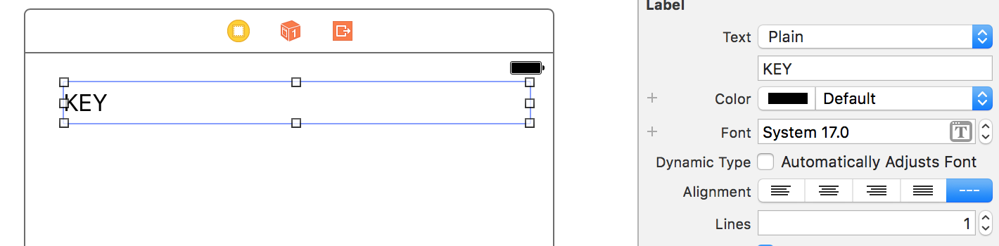
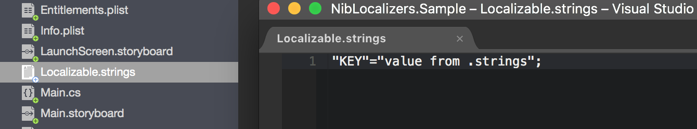
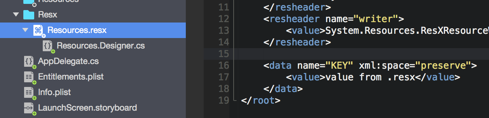
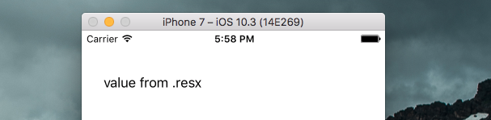

# NibLocalizers

Localize all your Xamarin.iOS storyboards and xibs automatically with just one line of code!

## Install

Available on NuGet

[](https://www.nuget.org/packages/NibLocalizers/)

## Quickstart

**Set keys in your storyboards/Nib**



**Initialize from an iOS `Localizable.strings` file**



```csharp
public class AppDelegate : UIApplicationDelegate
{
	public override bool FinishedLaunching(UIApplication application, NSDictionary launchOptions)
	{
		// Loads string from "Localizable.strings"
		Localization.InitializeFromBundle();
		return true;
	}
}
```

**Initialize from a `Resources.resx` file**



```csharp
public class AppDelegate : UIApplicationDelegate
{
	public override bool FinishedLaunching(UIApplication application, NSDictionary launchOptions)
	{
		// Loads string from "Resources.resx"
		Localization.InitializeFromResx(Resources.ResourceManager);
		return true;
	}
}
```



## Roadmap / Ideas

* More built-in localized components
* Ability to add your own component localizations
* Add culture selection for .strings

## About

This library was created for a team mate who was used to [AliSoftware/OHAutoNIBi18n](https://github.com/AliSoftware/OHAutoNIBi18n) library for its iOS native development. I was curious about swizzling in Xamarin.iOS and found out a solution [suggested by Miguel De Icaza](https://stackoverflow.com/questions/14127453/how-to-port-method-getimplementation-and-method-setimplementation-to-monotou).

Thanks to both **AliSoftware** and **Miguel**! :)

## Contributions

Contributions are welcome! If you find a bug please report it and if you want a feature please report it.

If you want to contribute code please file an issue and create a branch off of the current dev branch and file a pull request.

## License

MIT © [Aloïs Deniel](http://aloisdeniel.github.io)
